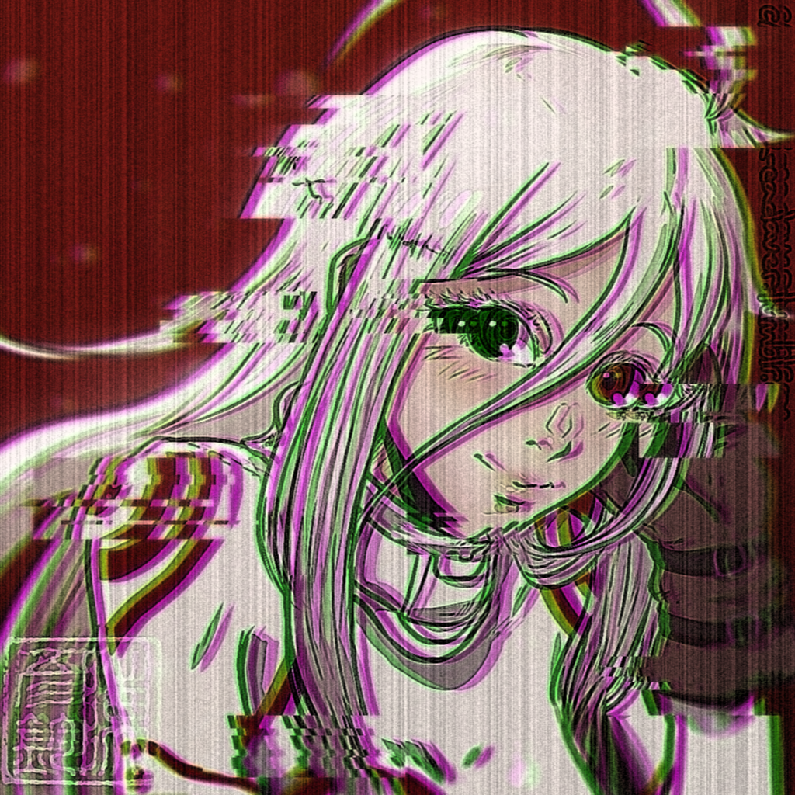

# Salodoff Discord bot

If you want to put him on your discord server acess this [link](https://discord.com/oauth2/authorize?client_id=658551592613576705&scope=bot&permissions=2146958847)

# Bot Icons:
<div>

<p>  </p>

</div>

This is a Discord bot in javascript (node.js). The code is free to view and anyone can study him to use in theirs bots.

I use an index to the main code, a commands and events handler to organize my code and some json files for some commands.
In the "Ajuda" folder are anothers discord bots that i have to see their codes to make this bot.
My bot is on Discloud server, a free host of discord bots.

## Instalation

To install the bot dependencies use this comamnd in the bot directory:
```
$ npm install
```

Configure the ```config.json``` file and then do
```
$ node .
```
to start the bot.

## Leonardo Zanotti